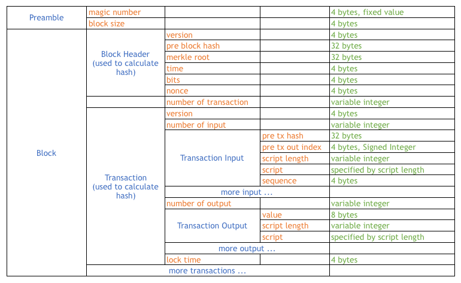

# bitcoin-block-parser

## Introduction

This project is based on the Python2 project
[blocktools](https://github.com/tenthirtyone/blocktools) which has not been 
updated since 2018-02-02 (as of 2022-02-02)

### Changes
* Upgrade syntax to Python3. Use type hints and `assert isinstance()` to facilitate the understanding of the code.
* Show both input's public key and its corresponding wallet address.
* Clarify the unit of `Difficulty`, show both difficulty value and raw value (as number of bits).
* Show Bitcoin `Script` the same way as [Bitcoin Wiki](https://en.bitcoin.it/wiki/Script), i.e., explicity show OP_CODEs as they are.
* Revise the section from `Script` to `Assembly` to match the term used by a few online Bitcoin block explorers'.
* Show `ScriptSig`'s hex representation, so that users can cross-reference the results from this script and some online Bitcoin block explorers'.
* Change formatting and indentation to make the output more structured.

## Sample Output

```text
Parsing 2 blocks
Parsing Block Chain block head, transaction etc.
#################### Blocks[0] BEGIN ####################

  Magic No: 			0XD9B4BEF9
  Blocksize (bytes): 	249696

  ########## Block Header BEGIN ##########
    Version               1
    Previous Block Hash   00000000000007622F14A36D73F689B91AACBE1B49FBD63491E23E66698E91FE
    Merkle Root           62544B83EEB918890D03708F2692E0E84AD23BE7EDD4C07A1A194BF42E3E5FAA
    Time stamp            2012-06-05 09:53:46.000000+00:00 (UTC)
    Difficulty            1591074.96 (436898655 bits)
    Nonce                 377894959
  ########## Block Header END ##########

  ########## Transaction Count: 612 ##########

  ########## Transaction Data BEGIN ##########
    ##### Transactions[0] #####
      Transaction Version:     1
      Input Count:             1
      ## Inputs[0] ##
        Coinbase Text:         0000000000000000000000000000000000000000000000000000000000000000
        Transaction Out Index: 4294967295  Coinbase with special index
        Script Length:         16
        ScriptSig(hex):        042ad7cd4f03503801062f503253482f
        Sequence:              4294967295 (== ffffffff, not in use)
      Output Count:	 1
      ## Outputs[0] ##
        Value:                 5,058,755,001 Satoshi (50.58755001 Bitcoin)
        Script Len:            35
        OP_CODE 33 is probably obselete pay to address
        Pubkey OP_CODE:	 None Bytes:33 tail_op_code:OP_CHECKSIG 
        Pure Pubkey:	   0212E5DEED81A1F2413CEFC68731996B97CA641BCBD8FB078A6A7923DE3F0C416A
        ScriptPubkey(hex):     210212E5DEED81A1F2413CEFC68731996B97CA641BCBD8FB078A6A7923DE3F0C416AAC
        Lock Time:	 0
    ##### Transactions[1] #####
      Transaction Version:     1
      Input Count:             1
      ## Inputs[0] ##
        Prev. Tx Hash:         46EC3D89443B481120A069AFC27083AB0756B72B73411368947E3EFBB914BB56
        Transaction Out Index: 1 
        Script Length:         140
        Script:                30460221008219D3EBF891C0E03829B8CF10227BBD621D60502AF37FDABF831F360ECAC667022100A24F11BF4C456523D07F1108221E314B718E01D19516F7DDB9FBFE2BDA8E8B6501
        InPubkey:              04BD738C9BF4F2B869BA9CA587472DF2D76D92E3D3D51C482352483261A2CB1C07C7D7CF03603975A494DCA8716E5B99D7F02C104DAA31CC610802EBC58D365E7D (Addr: b'1AXyaooXHLBvxGgoBp2pZcmNn6QU1rfDQG')
        ScriptSig(hex):        4930460221008219d3ebf891c0e03829b8cf10227bbd621d60502af37fdabf831f360ecac667022100a24f11bf4c456523d07f1108221e314b718e01d19516f7ddb9fbfe2bda8e8b65014104bd738c9bf4f2b869ba9ca587472df2d76d92e3d3d51c482352483261a2cb1c07c7d7cf03603975a494dca8716e5b99d7f02c104daa31cc610802ebc58d365e7d
        Sequence:              4294967295 (== ffffffff, not in use)
      Output Count:	 2
      ## Outputs[0] ##
        Value:                 2,064,100,000 Satoshi (20.641 Bitcoin)
        Script Len:            25
        Transaction Type:      Pay-to-PubkeyHash (P2PKH)
        PubkeyHash:            C63CB56087A3124A8BFC91876F46070406715688
        Assembly:              OP_DUP OP_HASH160 <PubkeyHash> OP_EQUALVERIFY OP_CHECKSIG
        ScriptPubkey(hex):     76A914C63CB56087A3124A8BFC91876F4607040671568888AC
      ## Outputs[1] ##
        Value:                 935,900,000 Satoshi (9.359 Bitcoin)
        Script Len:            25
        Transaction Type:      Pay-to-PubkeyHash (P2PKH)
        PubkeyHash:            74B1F24ED61081392DD4C374BCB38BC918D1AE15
        Assembly:              OP_DUP OP_HASH160 <PubkeyHash> OP_EQUALVERIFY OP_CHECKSIG
        ScriptPubkey(hex):     76A91474B1F24ED61081392DD4C374BCB38BC918D1AE1588AC
        Lock Time:	 0
    ##### Transactions[2] #####
      Transaction Version:     1
      Input Count:             1
      ## Inputs[0] ##
        Prev. Tx Hash:         DCF02B526F497ED8F6DE094DD9226CC1282B8C69A5B90FFEC61941723CF0678C
        Transaction Out Index: 0 
        Script Length:         138
        Script:                3044022011C4195C5A1575D93C6A17359CD64FCD315800CC6E598BE9273B5861E0D6E42302201AB847F5C688E5C6BC09006F3B39785CE7723B5878D355EBC6CA3522D467740701
        InPubkey:              04FC67D852454CD5E206BA50858746C819C499D772737F2C3198E85685D960CF42EED7AB998EAF3454B771736DEA34B0541E5B2BF121741B51E4CF8D083CCF47A9 (Addr: b'13ZPzHKZabHojtUpfMXJLd7XEfac2B7qFH')
        ScriptSig(hex):        473044022011c4195c5a1575d93c6a17359cd64fcd315800cc6e598be9273b5861e0d6e42302201ab847f5c688e5c6bc09006f3b39785ce7723b5878d355ebc6ca3522d4677407014104fc67d852454cd5e206ba50858746c819c499d772737f2c3198e85685d960cf42eed7ab998eaf3454b771736dea34b0541e5b2bf121741b51e4cf8d083ccf47a9
        Sequence:              4294967295 (== ffffffff, not in use)
      Output Count:	 2
      ## Outputs[0] ##
        Value:                 3,233,190,000 Satoshi (32.3319 Bitcoin)
        Script Len:            25
        Transaction Type:      Pay-to-PubkeyHash (P2PKH)
        PubkeyHash:            892DD974681BF7374BF615E78334892F0C25F0B5
        Assembly:              OP_DUP OP_HASH160 <PubkeyHash> OP_EQUALVERIFY OP_CHECKSIG
        ScriptPubkey(hex):     76A914892DD974681BF7374BF615E78334892F0C25F0B588AC
      ## Outputs[1] ##
        Value:                 766,810,000 Satoshi (7.6681 Bitcoin)
        Script Len:            25
        Transaction Type:      Pay-to-PubkeyHash (P2PKH)
        PubkeyHash:            EDBB0FD7739B2E866E956BB1CDAE9F20A018A5C1
        Assembly:              OP_DUP OP_HASH160 <PubkeyHash> OP_EQUALVERIFY OP_CHECKSIG
        ScriptPubkey(hex):     76A914EDBB0FD7739B2E866E956BB1CDAE9F20A018A5C188AC
        Lock Time:	 0
    ##### Transactions[3] #####
      Transaction Version:     1
      Input Count:             1
      ## Inputs[0] ##
        Prev. Tx Hash:         9118CC3D7C951F5DEDF03024A8BF6B2E20DFA1E6FD9F0EAAD70CC3CBAA2CE8B1
        Transaction Out Index: 1 
        Script Length:         139
        Script:                3045022042959A843654B2C4410EDDC185F59ED17A3855FC7B769F6B60CB22D004CA1DEB022100C527354500507507A9D399A4CA55CF2D79E37E155FCD6B370435E45D45A0D8B601
        InPubkey:              048063459F18A11BBB2664A39720D42A669598F0F3306575615F8D5AAFD8B645E2AF1EB0B521F06113963E79C7E7A648989D67A6288CDE586B121D3E6D8902975C (Addr: b'1CZtUf7xZF9f246gTgf6Na7rWRhjS4TUQM')
        ScriptSig(hex):        483045022042959a843654b2c4410eddc185f59ed17a3855fc7b769f6b60cb22d004ca1deb022100c527354500507507a9d399a4ca55cf2d79e37e155fcd6b370435e45d45a0d8b60141048063459f18a11bbb2664a39720d42a669598f0f3306575615f8d5aafd8b645e2af1eb0b521f06113963e79c7e7a648989d67a6288cde586b121d3e6d8902975c
        Sequence:              4294967295 (== ffffffff, not in use)
      Output Count:	 2
      ## Outputs[0] ##
        Value:                 15,900,000,000 Satoshi (159.0 Bitcoin)
        Script Len:            25
        Transaction Type:      Pay-to-PubkeyHash (P2PKH)
        PubkeyHash:            8BF7B1BC14AF4813F4B537BD08C24D7CC6F75FC0
        Assembly:              OP_DUP OP_HASH160 <PubkeyHash> OP_EQUALVERIFY OP_CHECKSIG
        ScriptPubkey(hex):     76A9148BF7B1BC14AF4813F4B537BD08C24D7CC6F75FC088AC
      ## Outputs[1] ##
        Value:                 1,500,000,000 Satoshi (15.0 Bitcoin)
        Script Len:            25
        Transaction Type:      Pay-to-PubkeyHash (P2PKH)
        PubkeyHash:            3AFE6B2AE2376F14200E5F0B2C86F4F44F51D980
        Assembly:              OP_DUP OP_HASH160 <PubkeyHash> OP_EQUALVERIFY OP_CHECKSIG
        ScriptPubkey(hex):     76A9143AFE6B2AE2376F14200E5F0B2C86F4F44F51D98088AC
        Lock Time:	 0
```
[remaining transactions are truncated]

## References
</img>

* [scriptPubKey & scriptSig Explained](https://www.mycryptopedia.com/scriptpubkey-scriptsig/)
* [Litte Big Endian Converter](https://blockchain-academy.hs-mittweida.de/litte-big-endian-converter/)